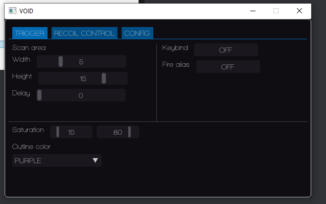

# VALORANT  
**Undetected external** cheat using HSV color detection.  
**Does not need Arduino, just bind a fire alias on Valorant.**  
This will not manipulate addresses and memories of the game, it's 100% memory independent so it's almost impossible to be detected. But you might be banned if reported by players.  
  
Customizable via menu.  
- Panic key is 'Del', press it to exit the cheat.  
  
    
 
# INFO    
- Change the saturation if it's shoting poorly or not shoting.  
The default saturation is 15 - 80 (Min - Max)       
Select a 'Keybind' and alias it to Valorant as a seconday fire key.   
1) In the game goto settings, find something like Keyboard or Keybinds. 
2) Find the Fire/Shoot Option:
    - by default the primary key is the left mouse button
    - the secondary it's not assigned (Bind it to any key, like 'K' ).
3) Go back to the software click once in 'Fire Alias' and then hit the same key, in this case 'K'.
4) According to [Trigger source code](https://github.com/dgrfps/valorant/blob/3191b89e7e2b36781529d51e897a1580f4c76131/Valorant/new/features/Trigger.hpp#L24), Keybind is a key that has to be pressed while you want to use the triggerbot (Do not bind the same as Fire Alias).

# WARNING  
This project won't be continued.  
I've not tested the cheat since 'first commit' release date.  

## COMPILATION  
Full step-by-step instructions are in [BUILD.md](BUILD.md), including the
troubleshooting table. Short version: download the
[GLFW pre-compiled binaries](https://www.glfw.org/download) and extract them to
`third_party/glfw`, then build `Void.sln` with Visual Studio 2022. The path is no
longer hardcoded in the project file — override it with the `GlfwDir` /
`GlfwLibDir` MSBuild properties if your GLFW lives somewhere else.

  
Feel free to make pull/reqs or collaborate.   
